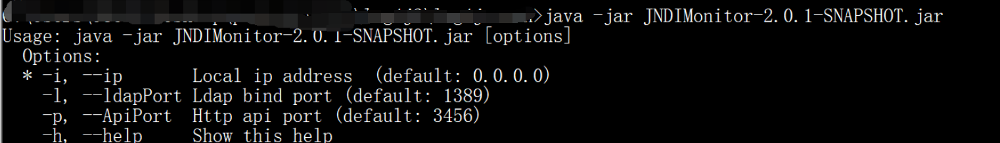
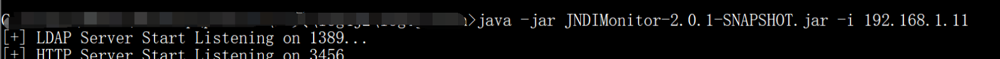
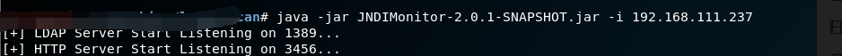
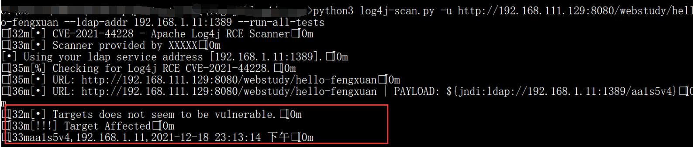
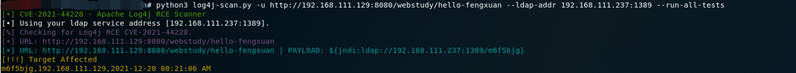

## 概述

log4j2 RCE漏洞（CVE-2021-44228)内网扫描器，可用于在不出网的条件下进行漏洞扫描，帮助企业内部快速发现Log4jShell漏洞。

修改自: https://github.com/fullhunt/log4j-scan

JNDIMonitor来自：[r00tSe7en/JNDIMonitor: 一个LDAP请求监听器，摆脱dnslog平台 (github.com)](https://github.com/r00tSe7en/JNDIMonitor)


**本工具仅供学习研究自查使用，切勿用于非法用途，由使用该工具产生的一切风险均与本人无关！**


## 使用

JNDIMonitor-2.0.1-SNAPSHOT.jar 和 log4j-scan.py必须放在同一目录下

### 1、开启ldap服务监听

可以公网启（扫互联网），也可以本地启（扫内网）

```
java -jar JNDIMonitor-2.0.1-SNAPSHOT.jar -i 192.168.1.11
```







### 2、启动log4j-scan.py进行扫描

#### 2.0

```
pip3 install -r requirements.txt
```

#### 2.1扫描单个URL (get 、header方式)

```
python3 log4j-scan.py -u http://192.168.111.129:8080/webstudy/hello-fengxuan --ldap-addr 192.168.1.11:1389
```

#### ⭐2.2扫描单个URL（ GET, POST (url-encoded form), POST (JSON body),HEADER方式）

```
python3 log4j-scan.py -u http://192.168.111.129:8080/webstudy/hello-fengxuan --ldap-addr 192.168.1.11:1389 --run-all-tests
```





### 2.3 bypass waf

```
python3 log4j-scan.py -u http://192.168.111.129:8080/webstudy/hello-fengxuan --ldap-addr 192.168.1.11:1389 --run-all-tests --waf-bypass
```

### 2.4 扫描URL列表

```
python3 log4j-scan.py -l urls.txt --ldap-addr 192.168.1.11:1389 --run-all-tests 

python3 log4j-scan.py -l urls.txt --ldap-addr 192.168.1.11:1389 --run-all-tests --waf-bypass
```

### 2.5 所有可选参数

```
python3 log4j-scan.py -h
[•] CVE-2021-44228 - Apache Log4j RCE Scanner
usage: log4j-scan.py [-h] [-u URL] [-p PROXY] [-l USEDLIST] [--request-type REQUEST_TYPE]
                     [--headers-file HEADERS_FILE] [--run-all-tests] [--exclude-user-agent-fuzzing]
                     [--wait-time WAIT_TIME] [--waf-bypass] [--test-CVE-2021-45046]
                     [--ldap-addr CUSTOM_DNS_CALLBACK_ADDR] [--disable-http-redirects]

optional arguments:
  -h, --help            show this help message and exit
  -u URL, --url URL     Check a single URL.
  -p PROXY, --proxy PROXY
                        send requests through proxy
  -l USEDLIST, --list USEDLIST
                        Check a list of URLs.
  --request-type REQUEST_TYPE
                        Request Type: (get, post) - [Default: get].
  --headers-file HEADERS_FILE
                        Headers fuzzing list - [default: headers.txt].
  --run-all-tests       Run all available tests on each URL.
  --exclude-user-agent-fuzzing
                        Exclude User-Agent header from fuzzing - useful to bypass weak checks on User-Agents.
  --wait-time WAIT_TIME
                        Wait time after all URLs are processed (in seconds) - [Default: 5].
  --waf-bypass          Extend scans with WAF bypass payloads.
  --test-CVE-2021-45046
                        Test using payloads for CVE-2021-45046 (detection payloads).
  --ldap-addr CUSTOM_DNS_CALLBACK_ADDR
                        Custom DNS Callback Address.
  --disable-http-redirects
                        Disable HTTP redirects. Note: HTTP redirects are useful as it allows the payloads to have higher chance of reaching vulnerable systems.
```

